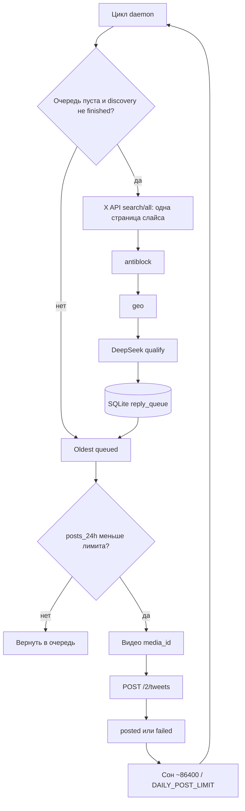

# Пайплайн

Цель: прямые ответы под одним parent-твитом → фильтр аудитории → очередь → 1 outreach-пост за цикл.

## Поиск

- Parent: `GET /2/tweets/:id` (Bearer).
- DeepSeek один раз на сессию строит keyword-фрагмент. Кэш: `reply_meta.keyword_query`.
- `GET /2/tweets/search/all`: `conversation_id:… is:reply to:<parent> (<keywords>)`.
- Только прямые ответы (`referenced_tweets.replied_to == parent_id`).
- Окна по 4 часа от времени parent — иначе `next_token` X обрывается на плотных днях.
- За цикл одна страница (до 100). Если очередь не пуста, discovery не вызывается.

## Фильтры

1. **antiblock** — стоп-фразы (война, шпионаж, «you should move»…). Статус `blocked`.
2. **geo** — `location` и username. Не Венгрия, не «уже в России».
3. **DeepSeek** — батчи по 15, score ≥ 7. Иначе `rejected`.

Один `@username` — один пост (`duplicate_user`): X банит одинаковый текст.

## Очередь и постинг

FIFO по `created_at`. Лимит/403 возвращают лид в `queued`. Прочий fail → `failed`, без повтора.

Текст: `@user` + `DEFAULT_REPLY_BODY`. Видео кэшируется в meta на ~23 часа. Пауза вокруг `86400 / DAILY_POST_LIMIT` (±55% jitter, минимум 90 с).

`discovery_complete=1` при пустой очереди **останавливает поиск**, даже если появились новые 4-часовые окна. Сброс флага в meta или `--refresh-keywords`.
