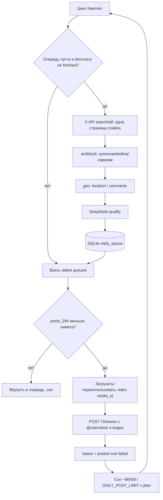

# Пайплайн данных

В проде работает **reply-бот**. Search-бот описан в конце: тот же принцип очереди, другой источник кандидатов.

## Reply-бот (прод)

Цель: найти **прямые ответы** людей под одним parent-твитом, отфильтровать целевую аудиторию, поставить в очередь, опубликовать 1 outreach-пост за цикл.

### 1. Поиск твитов

- Parent загружается один раз: `GET /2/tweets/:id` (Bearer).
- DeepSeek один раз на сессию строит keyword-фрагмент (`yes OR yeah OR si OR …`) под текст parent. Кэш: `reply_meta.keyword_query`.
- Поиск: `GET /2/tweets/search/all` с запросом вида  
  `conversation_id:<id> is:reply to:<parent_user> (<keywords>) <фильтры>`.
- В выдачу попадают **только прямые** ответы на parent (`referenced_tweets.replied_to == parent_id`). Вложенные реплаи отбрасываются.
- Время режется на окна по **4 часа** от `parent_created_at` до now. Это защита от обрыва `next_token` на плотных днях (суточное окно 7 июля теряло ~70% страниц).
- За цикл — **одна страница** (до 100 твитов). Если очередь не пуста, discovery **не вызывается**.

### 2. Фильтрация

Порядок жёсткий:

1. **antiblock** (`bot/reply_bot/antiblock.py`) — фиксированные фразы: шпионаж, война, «you should move», NATO/Zelensky и т.п. Статус `blocked`.
2. **geo** (`bot/reply_bot/region.py`) — поле `location` и подсказки в username. Цель: недружественные страны, **не** Венгрия, не «уже живёт в России». Неясная география может пройти дальше на DeepSeek.
3. **DeepSeek** (`bot/reply_bot/qualify.py`) — батчи по 15, score ≥ 7, JSON `approve true/false`. Статус `rejected` если нет.

Один `@username` — один outreach: повтор помечается `duplicate_user` (X банит одинаковый текст).

### 3. Очередь

Таблица `reply_queue`, FIFO по `created_at` (сначала старые ответы). Статусы: `queued` → `posted` | `failed` | `rejected` | `blocked` | `duplicate_user`.

Лид, который не удалось запостить из-за дневного лимита или паузы 403, **возвращается** в `queued`. Обычная ошибка постинга → `failed`, повторно не берётся.

### 4. Постинг

- Текст: `@username` + константа `DEFAULT_REPLY_BODY` из `bot/config.py`. LLM текст **не генерирует**.
- Видео: chunked upload X API v2, `media_id` кэшируется в meta на ~23 часа.
- 1 пост за цикл. Пауза: uniform вокруг `86400 / DAILY_POST_LIMIT` (на VPS 200/сутки → ~7.2 мин), jitter ±55%, минимум 90 сек.
- HTTP 403 `not permitted` → пауза постинга на 5 часов (`post_blocked_until`), лид остаётся в очереди.
- HTTP 402 `credits depleted` → статус `failed` (кредит не восстановится сам). Очередь после этого рано или поздно опустеет, и бот будет крутить пустые циклы.

### Когда discovery останавливается

Флаг `discovery_complete=1`, когда пройден последний слайс. Если очередь пуста и флаг стоит, **поиск больше не вызывается**, даже если с тех пор появились новые 4-часовые окна. Это текущее поведение прода (31.08.2026: queue=0, discovery=done, slice 237/245). Чтобы продолжить, разработчик сбрасывает флаг в meta или перезапускает с `--refresh-keywords`.

## Search-бот (не прод)

`run_bot.py` → `bot/pipeline.py`:

1. Keyword-паттерны (`bot/search_queries.py`, 10 штук) по временным слайсам 5 дней внутри окна 30 дней, дно → поверхность.
2. `search/recent` если слайс в последних 7 днях, иначе `search/all`.
3. DeepSeek qualify (`bot/deepseek_qualify.py`).
4. Если слайс исчерпан и задан `XAI_API_KEY` — fallback Grok `x_search`.
5. Verify твита через X API, enqueue в `processed_tweets`.
6. 1 пост/цикл, тот же текст и видео.

Discovery вызывается только если очередь ≤ `QUEUE_REFILL_THRESHOLD` (по умолчанию 5) и не упёрлись в дневной лимит.
